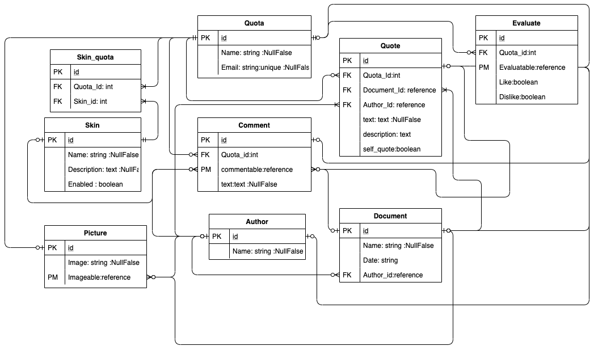

# Quota
SNS idea for People who likes and wants to quote
whether someone famous or not, as well as themselves

# Database

- Quotas(works as user)

| key | column      | type    | options    |
|:----|:------------|:--------|:-----------|
| PK  | id          | integer |            |
|     | name        | string  | null:false |
|     | email       | string  |            |

has_many quotes  
has_many comments  
has_many evaluates  
has_many skins  
has_many skin_quotas  
has_many pictures  

- Quotes

| key | column      | type    | options    |
|:----|:------------|:--------|:-----------|
| PK  | id          | integer |            |
|     | text        | text    | null:false |
|     | description | text    |            |
|     | selfquote   | boolean |            |
| FK  | quota_id    | integer |            |
| FK  | document_id | integer |            |
| FK  | author_id   | integer |            |

has_many pictures  
has_many evaluates  
has_many comments  
belongs_to quota  
belongs_to author  
belongs_to document  

- Documents

| key | column      | type    | options    |
|:----|:------------|:--------|:-----------|
| PK  | id          | integer |            |
|     | name        | string  | null:false |
|     | date        | string  |            |

has_many comments  
has_many pictures  
belongs_to author  

- Authors

| key | column      | type    | options    |
|:----|:------------|:--------|:-----------|
| PK  | id          | integer |            |
|     | name        | string  | null:false |

has_many comments  
has_many pictures  
has_many documents  

- Skins

| key | column      | type    | options    |
|:----|:------------|:--------|:-----------|
| PK  | id          | integer |            |
|     | name        | string  | null:false |
|     | description | text    | null:false |
|     | enabled     | boolean |            |

has_many quotas  
has_many skin_quotas  

- Pictures

| key | column      | type    | options    |
|:----|:------------|:--------|:-----------|
| PK  | id          | integer |            |
|     | image       | string  | null:false |

belongs_to imageable, polymorphic: true  

- Evaluates

| key | column      | type    | options    |
|:----|:------------|:--------|:-----------|
| PK  | id          | integer |            |
| FK  |quota_id     | integer |            |
|     | like        | boolean |            |
|     | dislike     | boolean |            |

belongs_to evaluatable, polymorphic: true  

- Comments

| key | column      | type    | options    |
|:----|:------------|:--------|:-----------|
| PK  | id          | integer |            |
| FK  |quota_id     | integer |            |
|     | text        | text    | null:false |

belongs_to commentable, polymorphic: true  
